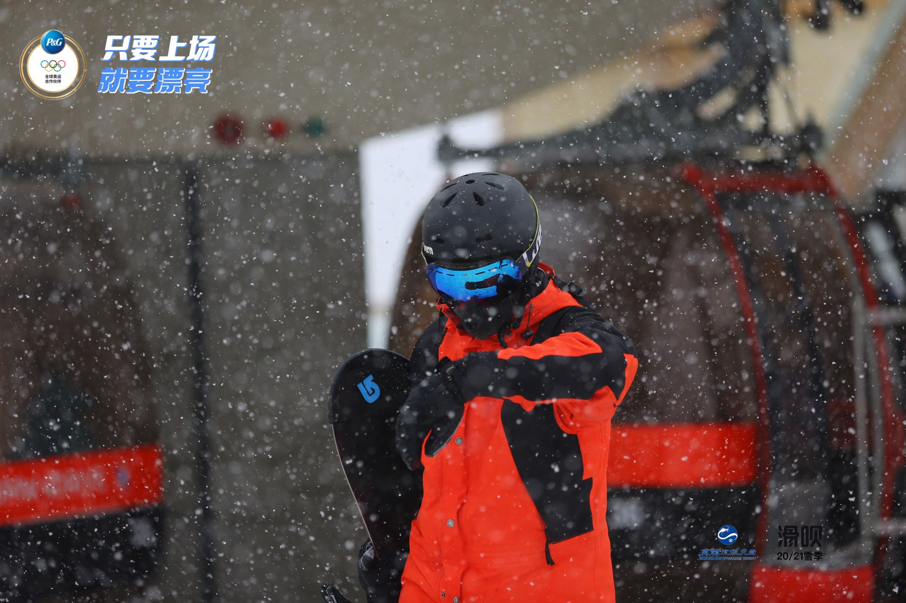

# Introduction

## Experience with programming
**Major**: Math-cs\
**Years of programming**: 1.5\
Learned from previous cse courses:
> start early, start often

Programming language I learned:
1. Java
2. c++
3. javascript,css,html

Git commands to add git:
```
git add
```

Following is my [GitHub Pages](https://github.com/Xubangbangg).\
[Readme of part1 of this lab](./README.md).

## Intro to myself
My hobby: 
- Workout
- Guitar
- Snowboarding

[Go to somewhere](#Introduction)


This is image of snowboarding：


To-do list today:
- [x] finish cse110 lab1
- [ ] workout
- [ ] math170a quiz